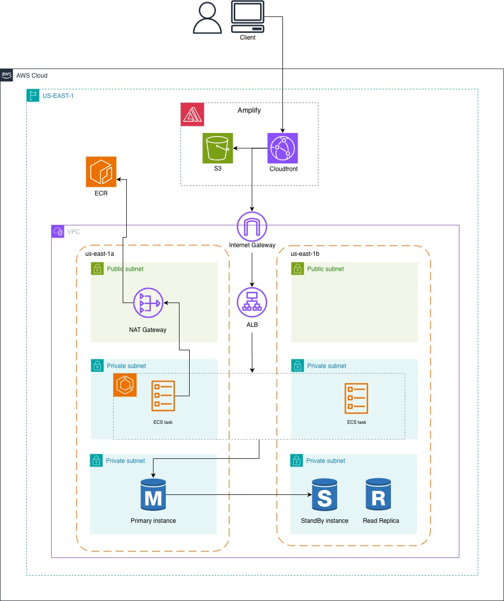

# Three-Tier AWS Infrastructure

This repository contains Terraform configurations for deploying a complete three-tier web application infrastructure on AWS. The infrastructure includes networking, compute, database, and optional frontend hosting components.

## Table of Contents

- [Overview](#overview)
- [Architecture](#architecture)
- [Components](#components)
- [Infrastructure Details](#infrastructure-details)
- [Configuration](#configuration)
- [Prerequisites](#prerequisites)
- [Deployment](#deployment)
- [Outputs](#outputs)

## Overview

This infrastructure provides a production-ready three-tier architecture for web applications with the following characteristics:

- **Region**: `us-east-1`
- **Environment**: Development
- **Provider**: AWS
- **Terraform AWS Provider Version**: `~> 6.0`

The architecture implements best practices for security, scalability, and high availability using AWS services.

## Architecture



## Components

### 1. Networking (`networking.tf`)

#### VPC Module

- **CIDR Block**: `10.0.0.0/16`
- **DNS Support**: Enabled
- **DNS Hostnames**: Enabled
- **Availability Zones**: Multi-AZ deployment across `us-east-1a` and `us-east-1b`

#### Subnets

The VPC contains 6 subnets organized into three tiers:

| Subnet | CIDR Block   | AZ         | Type | Public | NAT Required |
| ------ | ------------ | ---------- | ---- | ------ | ------------ |
| Web-1  | 10.0.1.0/24  | us-east-1a | web  | Yes    | No           |
| Web-2  | 10.0.2.0/24  | us-east-1b | web  | Yes    | No           |
| App-1  | 10.0.10.0/24 | us-east-1a | app  | No     | Yes          |
| App-2  | 10.0.30.0/24 | us-east-1b | app  | No     | Yes          |
| DB-1   | 10.0.20.0/24 | us-east-1a | db   | No     | No           |
| DB-2   | 10.0.40.0/24 | us-east-1b | db   | No     | No           |

#### Internet Gateway

- Single Internet Gateway attached to the VPC
- Enables public subnets to access the internet

#### NAT Gateway

- Deployed in public subnet (us-east-1a)
- Enables private application subnets to access the internet for outbound connections
- Elastic IP associated for static public IP

#### Route Tables

- **Public Route Table**: Routes traffic to Internet Gateway (0.0.0.0/0)
- **Private Route Table**: Routes traffic to NAT Gateway for internet access

#### Security Groups

**Web Security Group** (`web_sg`)

- **Ingress**: HTTP (80) and HTTPS (443) from 0.0.0.0/0
- **Egress**: All traffic (0.0.0.0/0)
- **Attached to**: Application Load Balancer

**Application Security Group** (`app_sg`)

- **Ingress**: Port 8080 from ALB security group
- **Egress**: All traffic (0.0.0.0/0)
- **Attached to**: ECS Fargate tasks

**Database Security Group** (`db_sg`)

- **Ingress**: PostgreSQL (5432) from application security group only
- **Egress**: All traffic (0.0.0.0/0)
- **Attached to**: RDS instances

#### Database Subnet Group

- Created for RDS deployment
- Contains all subnets tagged with `Type = "db"`
- Enables Multi-AZ RDS deployment

### 2. Application Load Balancer (`networking.tf`)

- **Name**: `{project_name}-alb`
- **Type**: Application Load Balancer (ALB)
- **Scheme**: Internet-facing
- **Protocol**: HTTP only (port 80)
- **Subnets**: All public subnets (web tier)
- **Deletion Protection**: Disabled (for development)

#### Listeners

- **HTTP Listener**: Port 80
  - Forwards to target group: `backend_api_tg`

#### Target Group (`backend_api_tg`)

- **Protocol**: HTTP
- **Port**: 80
- **Target Type**: IP (for ECS Fargate)
- **Health Check**:
  - Path: `/health/`
  - Interval: 30 seconds
  - Timeout: 5 seconds
  - Healthy threshold: 3
  - Unhealthy threshold: 3
  - Success codes: 200

#### Security Rules

- **Ingress**: HTTP (80) from 0.0.0.0/0
- **Egress**: All traffic to VPC CIDR (10.0.0.0/16)

### 3. ECS (Elastic Container Service) (`container.tf`)

#### ECS Cluster

- **Name**: `{project_name}-cluster`
- **Capacity Providers**:
  - **FARGATE**: Weight 50, Base 20
  - **FARGATE_SPOT**: Weight 50
- **Execute Command**: Enabled with CloudWatch logging
- **Log Group**: `/aws/ecs/{project_name}`

#### ECS Service: `backend_api`

- **Launch Type**: FARGATE
- **Desired Count**: Configurable (default: 2 tasks)
- **CPU**: 1024 (1 vCPU)
- **Memory**: 2048 MB (2 GB)
- **Subnets**: Application subnets (private)
- **Assign Public IP**: No
- **IAM Roles**:
  - **Task Execution Role**: Required (must exist)
  - **Tasks Role**: Required (must exist)

#### Container Definition: `api`

- **Image**: Configurable ECR image URI
- **CPU**: 1024 (1 vCPU)
- **Memory**: 2048 MB (2 GB)
- **Port**: 8080 (TCP)
- **Essential**: Yes

#### Health Check

- **Command**: `curl -f http://localhost:8080/health/ || exit 1`
- **Interval**: 30 seconds
- **Timeout**: 5 seconds
- **Retries**: 3
- **Start Period**: 60 seconds

#### Environment Variables

- User-defined variables via `env_variables` map
- **DB_URL**: Automatically set to RDS endpoint
- **DB_PASSWORD**: Automatically set from RDS credentials

#### Load Balancer Integration

- Container port 8080 mapped to target group port 80
- Automatic registration with ALB target group

### 4. RDS (Relational Database Service) (`rds.tf`)

#### Primary Database Instance

- **Identifier**: `{project_name}-db-master`
- **Engine**: PostgreSQL
- **Version**: PostgreSQL 14
- **Family**: `postgres14`
- **Instance Class**: `db.t3.micro` (configurable)
- **Multi-AZ**: Enabled for high availability
- **Allocated Storage**: 5-10 GB (configurable, default: 10 GB)
- **Database Name**: Configurable
- **Username**: Configurable (default: `meal_user`)
- **Password**: Configurable (validated for complexity)
- **Port**: 5432
- **Subnet Group**: Database subnet group
- **Security Groups**: Database security group only
- **Backup Window**: 03:00-06:00 UTC
- **Maintenance Window**: Mon 00:00-03:00 UTC
- **Backup Retention**: 0 days (for development)
- **Apply Immediately**: Yes

#### Read Replica

- **Identifier**: `{project_name}-db-replica`
- **Type**: Read replica of primary instance
- **Multi-AZ**: Disabled
- **Same configuration as primary** (except Multi-AZ)
- **Automatically replicates** from master

### 5. AWS Amplify (Optional) (`amplify.tf`)

- **Resource**: Conditionally created based on `create_amplify_app` variable
- **Name**: `{project_name}-amplify`
- **Repository**: Configurable Git repository
- **Branch**: Configurable (default: `main`)
- **Access Token**: Required for repository access

#### Build Specification

- **Pre-build**: `yarn install`
- **Build**: `yarn run build`
- **Artifacts**: `build/**/*`
- **Cache**: `node_modules/**/*`

#### Branch Configuration

- Basic auth: Disabled
- Pull request previews: Disabled

## Configuration

### Required Variables (`variables.tf`)

#### Application Configuration

- `project_name` (string, required): Name of the project
- `app_image` (string, required): ECR image URI for the application container
- `env_variables` (map(string), optional): Environment variables for the application
- `ecs_service_desired_count` (number, default: 2): Number of ECS tasks to run

#### IAM Roles

- `task_exec_iam_role_name` (string, required): Name of IAM role for ECS task execution
- `tasks_iam_role_name` (string, required): Name of IAM role for ECS tasks

#### RDS Configuration

- `rds_credentials` (object, required):
  - `username` (string): Database username
  - `password` (string): Must be at least 8 characters with letter, number, and special character
- `rds_engine` (object, default: PostgreSQL 14):
  - `engine` (string): Database engine
  - `family` (string): Parameter group family
  - `major_engine_version` (string): Major version
- `rds_instance_class` (string, default: `db.t3.micro`): RDS instance type
- `rds_allocated_storage` (number, default: 10): Storage in GB (5-10 GB range)
- `rds_default_db_name` (string, required): Default database name

#### Amplify Configuration (Optional)

- `create_amplify_app` (bool, default: false): Whether to create Amplify app
- `amplify_app_repository` (object, optional):
  - `repository` (string): Git repository
  - `branch` (string, default: "main"): Branch to deploy
  - `token` (string, sensitive): Access token for repository
- `amplify_variables` (map(string), optional): Amplify environment variables

### Example Configuration (`terraform.tfvars`)

```hcl
project_name = "my-application"

app_image = "123456789.dkr.ecr.us-east-1.amazonaws.com/myapp:latest"

env_variables = {
  DB_USER             = "app_user"
  STAGE               = "development"
  S3_BUCKET_NAME      = "my-application-data"
  COGNITO_CLIENT_ID   = "example_client_id"
  COGNITO_USER_POOL_ID = "us-east-1_example"
  COGNITO_ISSUER_URI   = "https://cognito-idp.us-east-1.amazonaws.com/us-east-1_example"
}

task_exec_iam_role_name = "ecsTaskExecutionRole"
tasks_iam_role_name     = "ecsTaskExecutionRole"

rds_credentials = {
  username = "app_user"
  password = "SecurePass123!"
}

rds_default_db_name = "appdb"

ecs_service_desired_count = 2

create_amplify_app = false
```

## Prerequisites

1. **AWS Account**: Access to AWS with appropriate permissions
2. **Terraform**: Version compatible with AWS provider ~> 6.0
3. **AWS CLI**: Configured with appropriate credentials
4. **IAM Roles**: Pre-existing IAM roles for ECS:
   - Task execution role (e.g., `ecsTaskExecutionRole`)
   - Tasks role (e.g., `ecsTaskExecutionRole`)
5. **ECR Image**: Container image must exist in ECR and be accessible
6. **AWS Region**: Deployment region must be `us-east-1` (hardcoded in some resources)

## Deployment

### Initial Setup

1. **Clone the repository** (if applicable)

   ```bash
   git clone <repository-url>
   cd MealInfra
   ```

2. **Configure variables**

   - Copy and modify `terraform.tfvars` with your values
   - Ensure all required variables are set

3. **Initialize Terraform**

   ```bash
   terraform init
   ```

4. **Review the plan**

   ```bash
   terraform plan
   ```

5. **Apply the configuration**
   ```bash
   terraform apply
   ```

### Updating Infrastructure

1. **Modify configuration files** as needed
2. **Review changes**
   ```bash
   terraform plan
   ```
3. **Apply changes**
   ```bash
   terraform apply
   ```

### Destroying Infrastructure

⚠️ **Warning**: This will delete all resources including databases and their data.

```bash
terraform destroy
```

## Outputs

The following outputs are available after deployment:

- `vpc_id`: The ID of the VPC
- `public_subnet_ids`: List of public subnet IDs
- `private_subnet_ids`: List of private subnet IDs
- `app_security_group_id`: ID of the application security group
- `db_security_group_id`: ID of the database security group
- `web_security_group_id`: ID of the web security group
- `db_instance_endpoint`: RDS instance endpoint (hostname)
- `db_instance_port`: RDS instance port (5432)
- `db_instance_identifier`: RDS instance identifier
- `DB_url`: Full JDBC connection string for the database

### Example Output Usage

```bash
# Get database endpoint
terraform output db_instance_endpoint

# Get JDBC URL
terraform output DB_url

# Get VPC ID
terraform output vpc_id
```

## Module Structure

```
MealInfra/
├── modules/
│   └── vpc/
│       ├── main.tf          # VPC, subnets, gateways, security groups
│       ├── variables.tf     # VPC module variables
│       ├── outputs.tf       # VPC module outputs
│       └── versions.tf      # Provider versions
├── amplify.tf               # AWS Amplify configuration
├── container.tf             # ECS cluster and service
├── networking.tf            # ALB and VPC module invocation
├── outputs.tf               # Root module outputs
├── provider.tf              # AWS provider configuration
├── rds.tf                   # RDS primary and replica
├── variables.tf             # Root module variables
├── terraform.tfvars         # Variable values (not committed)
└── README.md                # This file
```
